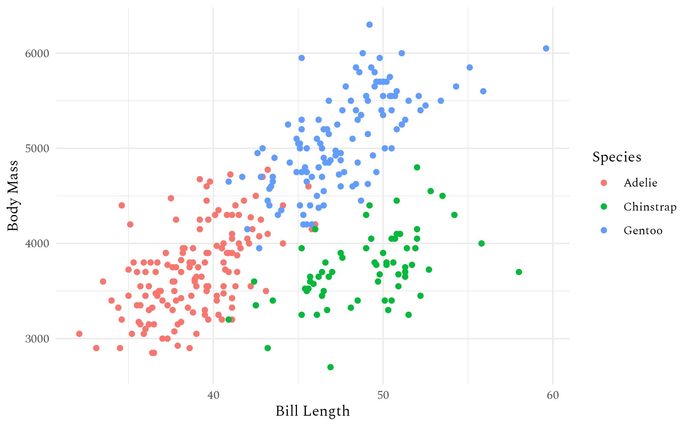

# Using systemfonts to handle fonts in R

> This text expects a basic understanding of fonts and typography. If
> you feel like you could use a brush-up you can consult [this light
> introduction to the
> subject](https://systemfonts.r-lib.org/articles/fonts_basics.md).

systemfonts is designed to give R a modern text rendering stack. That’s
unfortunately impossible without coordination with the graphics device,
which means that to use all these features you need a supported graphics
device. There are currently two options:

- The [ragg](https://ragg.r-lib.org) package provides graphics devices
  for rendering raster graphics in a variety of formats (PNG, JPEG,
  TIFF) and uses systemfonts and textshaping extensively.
- The [svglite](https://svglite.r-lib.org) package provides a graphic
  device for rendering vector graphics to SVG using systemfonts and
  textshaping for text.

You might notice there’s currently a big hole in this workflow: PDFs.
This is something we plan to work on in the future.

## A systemfonts based workflow

With all that said, how do you actually use systemfonts to use custom
fonts in your plots? First, you’ll need to use ragg or svglite.

### Using ragg

While there is no way to unilaterally make
[`ragg::agg_png()`](https://ragg.r-lib.org/reference/agg_png.html) the
default everywhere, it’s possible to get close:

- Positron: recent versions automatically use ragg for the plot pane if
  it’s installed.

- RStudio IDE: set “AGG” as the backend under Global Options \> General
  \> Graphics.

- [`ggplot2::ggsave()`](https://ggplot2.tidyverse.org/reference/ggsave.html):
  ragg will be automatically used for raster output if installed.

- R Markdown and Quarto: you need to set the `dev` option to
  `"ragg_png"`. You can either do this with code:

  ``` r
  #| include: false
  knitr::opts_chunk$set(dev = "ragg_png")
  ```

  Or in Quarto, you can set it in the yaml metadata:

  ``` yaml
  ---
  title: "My Document"
  format: html
  knitr:
    opts_chunk:
      dev: "ragg_png"
  ---
  ```

If you want to use a font installed on your computer, you’re done!

``` r
grid::grid.text(
  "Spectral 🎉",
  gp = grid::gpar(fontfamily = "Spectral", fontface = 2, fontsize = 30)
)
```


Or, if using ggplot2

``` r
library(ggplot2)
ggplot(na.omit(penguins)) +
  geom_point(aes(x = bill_len, y = body_mass, colour = species)) +
  labs(x = "Bill Length", y = "Body Mass", colour = "Species") +
  theme_minimal(base_family = "Spectral")
```



If the results don’t look as you expect, you can use various systemfonts
helpers to diagnose the problem:

``` r
systemfonts::match_fonts("Spectral", weight = "bold")
#>                               path index features variations
#> 1 /tmp/Rtmp5BNs5G/Spectral-700.ttf     0
systemfonts::font_fallback("🎉", family = "Spectral", weight = "bold")
#>                                                path index
#> 1 /usr/share/fonts/truetype/noto/NotoColorEmoji.ttf     0
```

If you want to see all the fonts that are available for use, you can use
[`systemfonts::system_fonts()`](https://systemfonts.r-lib.org/reference/system_fonts.md)

``` r
systemfonts::system_fonts()
```

### Extra font styles

As we discussed above, the R interface only allows you to select between
four styles: plain, italic, bold, and bold-italic. If you want to use a
thin font, you have no way of communicating this wish to the device. To
overcome this, systemfonts provides
[`register_variant()`](https://systemfonts.r-lib.org/reference/register_variant.md)
which allows you to register a font with a new typeface name. For
example, to use the light font from the Spectral typeface you can
register it as follows:

``` r
systemfonts::register_variant(
  name = "Spectral Light",
  family = "Spectral",
  weight = "light"
)
```

Now you can use Spectral Light where you would otherwise specify the
typeface:

``` r
grid::grid.text(
  "Light weight is soo classy",
  gp = grid::gpar(fontfamily = "Spectral Light", fontsize = 30)
)
```


[`register_variant()`](https://systemfonts.r-lib.org/reference/register_variant.md)
also allows you to turn on font features otherwise hidden away:

``` r
systemfonts::register_variant(
  name = "Spectral Small Caps",
  family = "Spectral",
  features = systemfonts::font_feature(
    letters = "small_caps"
  )
)
grid::grid.text(
  "All caps — Small caps",
  gp = grid::gpar(fontfamily = "Spectral Small Caps", fontsize = 30)
)
```


### Fonts from other places

Historically, systemfonts primary role was to access the font installed
on your computer, the **system fonts**. But what if you’re using a
computer where you don’t have the rights to install new fonts, or you
don’t want the hassle of installing a font just to use it for a single
plot? That’s the problem solved by `systemfonts::add_font()` which makes
it easy to use a font based on a path. But in many cases you don’t even
need that as systemfont now scans `./fonts` and `~/fonts` and adds any
font files it find. This means that you can put personal fonts in a
fonts folder in your home directory, and project fonts in a fonts
directory at the root of the project. This is a great way to ensure that
specific fonts are available when you deploy some code to a server.

And you don’t even need to leave R to populate these folders.
[`systemfonts::get_from_google_fonts()`](https://systemfonts.r-lib.org/reference/web-fonts.md)
will download and install a google font in `~/fonts`:

``` r
systemfonts::get_from_google_fonts("Barrio")

grid::grid.text(
  "A new font a day keeps Tufte away",
  gp = grid::gpar(fontfamily = "Barrio", fontsize = 30)
)
```


And if you want to make sure this code works for anyone using your code
(regardless of whether or not they already have the font installed), you
can use
[`systemfonts::require_font()`](https://systemfonts.r-lib.org/reference/require_font.md).
If the font isn’t already installed, this function download it from one
of the repositories it knows about. If it can’t find it it will either
throw an error (the default) or remap the name to another font so that
plotting will still succeed.

``` r
systemfonts::require_font("Rubik Distressed")
#> Trying Google Fonts... Found! Downloading font to /tmp/Rtmp5BNs5G

grid::grid.text(
  "There are no bad fonts\nonly bad text",
  gp = grid::gpar(fontfamily = "Rubik Distressed", fontsize = 30)
)
```


By default,
[`require_font()`](https://systemfonts.r-lib.org/reference/require_font.md)
places new fonts in a temporary folder so it doesn’t pollute your
carefully curated collection of fonts.

### Font embedding in SVG

Fonts work a little differently in vector formats like SVG. These
formats include the raw text and only render the font when you open the
file. This makes for small, accessible files with crisp text at every
level of zoom. But it comes with a price: since the text is rendered
when it’s opened, it relies on the font in use being available on the
viewer’s computer. This obviously puts you at the mercy of their font
selection, so if you want consistent outputs you’ll need to **embed**
the font.

In SVG, you can embed fonts using an `@import` statement in the
stylesheet, and can point to a web resource so the SVG doesn’t need to
contain the entire font. systemfonts provides facilities to generate
URLs for import statements and can provide them in a variety of formats:

``` r
systemfonts::fonts_as_import("Barrio")
#> [1] "https://fonts.bunny.net/css2?family=Barrio&display=swap"
systemfonts::fonts_as_import("Rubik Distressed", type = "link")
#> [1] "<link rel=\"stylesheet\" href=\"https://fonts.bunny.net/css2?family=Rubik+Distressed&display=swap\"/>"
```

Further, if the font is not available from a given online repository, it
can embed the font data directly into the URL:

``` r
substr(systemfonts::fonts_as_import("Arial", repositories = NULL), 1, 200)
#> Warning in systemfonts::fonts_as_import("Arial", repositories = NULL):
#> No import found for Arial
#> character(0)
```

svglite uses this feature to allow seamless font embedding with the
`web_fonts` argument. It can take a URL as returned by
[`fonts_as_import()`](https://systemfonts.r-lib.org/reference/fonts_as_import.md)
or just the name of the typeface and the URL will automatically be
resolved. Look at line 6 in the SVG generated below

``` r
svg <- svglite::svgstring(web_fonts = "Barrio")
grid::grid.text("Example", gp = grid::gpar(fontfamily = "Barrio"))
invisible(dev.off())
svg()
#> <?xml version='1.0' encoding='UTF-8' ?>
#> <svg xmlns='http://www.w3.org/2000/svg' xmlns:xlink='http://www.w3.org/1999/xlink' width='720.00pt' height='576.00pt' viewBox='0 0 720.00 576.00'>
#> <g class='svglite'>
#> <defs>
#>   <style type='text/css'><![CDATA[
#>     @import url('https://fonts.bunny.net/css2?family=Barrio&display=swap');
#>     .svglite line, .svglite polyline, .svglite polygon, .svglite path, .svglite rect, .svglite circle {
#>       fill: none;
#>       stroke: #000000;
#>       stroke-linecap: round;
#>       stroke-linejoin: round;
#>       stroke-miterlimit: 10.00;
#>     }
#>     .svglite text {
#>       white-space: pre;
#>     }
#>     .svglite g.glyphgroup path {
#>       fill: inherit;
#>       stroke: none;
#>     }
#>   ]]></style>
#> </defs>
#> <rect width='100%' height='100%' style='stroke: none; fill: #FFFFFF;'/>
#> <defs>
#>   <clipPath id='cpMC4wMHw3MjAuMDB8MC4wMHw1NzYuMDA='>
#>     <rect x='0.00' y='0.00' width='720.00' height='576.00' />
#>   </clipPath>
#> </defs>
#> <g clip-path='url(#cpMC4wMHw3MjAuMDB8MC4wMHw1NzYuMDA=)'>
#> <text x='360.00' y='292.32' text-anchor='middle' style='font-size: 12.00px; font-family: "Barrio";' textLength='48.12px' lengthAdjust='spacingAndGlyphs'>Example</text>
#> </g>
#> </g>
#> </svg>
```

## Want more?

This text has mainly focused on how to use the fonts you desire from
within R. R has other limitations when it comes to text rendering
specifically how to render text that consists of a mix of fonts. This
has been solved by [marquee](https://marquee.r-lib.org) and the curious
soul can continue there in order to up their skills in rendering text
with R.
